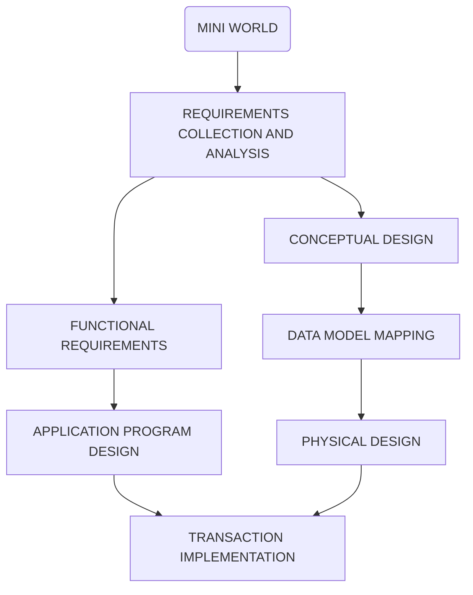

# Databases

## Introduction

Data -> Facts: Product of observation

Ways to register data:

* Unstructured Data: ex. txt files
* Structured Data (SQL) : ex. tabular representation
* Semi-structured (MongoDB): ex. XML, JSON

Why keep data?

* To take some action based on the data
* Data that is used to answer questions do analysis ->information

### Source of Data

Mini World:

* Data cannot be known about the entire world or about everything or every topic.
* We need to restrict the domain from which we are going to gather data.

* The data that we store about our mini-world can be:
  * Used directly
  * Through a system (Information System)

Information System (Application) Design

* **Left Track is system design** while **right track is data design**




### Data Storage

* **Sequential (access) files**: 
  * Data can only be read/stored sequentially.
* **Random access files:** 
  * In order to be able to effectively use random access files, we need to have efficient algorithms for insertion, deletion, and searching.
  * B+ trees, Hash Tables

### Concurrency

* Two or more users want to access the same file location at the same time

### DBMS (Database Management System)

* **Definition**: efficient, reliable, convenient, and safe multi-user storage of and access to massive amounts of persistent data

#### Desirable services provide by many IM  (Information Management System) and DBMS

* **Persistence**: Maintain information even after program stops
* **Convenient Access**: 
  * Ability to ask question declaratively rather than programmatically
  * Hide and change implementation
  * Queries optimized to speed up answering
* **Deal with massive amounts of facts**
* **Performance**: High speed even in the presence of many operations and data
* **Consistency during concurrent access**.

#### Other Features (Specialized IM)

* **Resilience**: Ability to survive hardware, software, and power failures
* **Reliability**: Almost always up
* **Scalability**: Data can be scaled to demand or size needs

### Types of Database Models

* **Hierarchical Model**
  * Assumes that all the data that is **stored is organized hierarchically**
  * The Hierarchical model looks like a **tree**, and elements are found by following the links.
  * Every node has just one parent
  * ex. File Systems and Geographical Information Systems
* **Network Model**
  * Assumes that a **given node might have more than one parent**
  * Search by following pointers
* **Relational Model**
  * Uses relations or tables
  * Search by content not by following links or pointers.
  * ER Diagram -> Relations
* **Object Oriented Model**
  * Lots of problems when communicating OO applications with databases in relational model
  * In order to try to circumvent the problems of OO – Database connectivity and work on a common set of data.

## Conceptual Design

### Entity - Relationship Diagrams

* **Entity Sets**: Set of similar elements
  * No duplicate elements
  * **Candidate Key:** minimal set of attributes that uniquely identifies an element 
    * **Minimal**: If an attribute is removed from a set then there is not enough information to uniquely identify the element.
    * ex. name alone can't identify an employee but name and phone number might
  * **Primary Key:**
    * The chosen candidate key will be enforced by the DBMS
    * The primary key attributes will be **underlined in their circles**
    * Every entity set must have a primary key
  * Rectangle with element
* **Attributes**: Aspects of an elements
  * **Circles** = **Single Attribute** (ex. Name)
  * **Double Border Circles** = **Multivalued Attributes** (ex. Phone Numbers)
  * **Circles with child circles** = **Composite Attributes** (ex. Address)
  * **Dotted Circle** = **Derived Attribute**: computed from the other attributes in the entity set (ex. age calculated form date of birth attribute)
* **Domain**: Need to specify if attributes aren't clear
* **Relationship**: Connection between Entity Sets
  * Represented by a **diamond**
  * Attributes can be added to the relationship
* **Cardinality**:
  * Many to Many
  * One to Many: Every element from A is related to at most one element from B (-> at most one)
    * ex. Professor can teach many courses, but a course is taught by 1 professor
  * One to One: Each element from A is related to at most one element from B and each element from B is related to at most one element from A
    * ex. A Professor can only have one office, and a office can only have one professor

ex. Employees work for Departments

* Departments have an id, address, name, phone
* Employees have a ssn, name, phone, dob
* Each employee cannot work for more than one department
* Each department can have many employees


* **Participation Constraints:**
  * **Total**: Every Element from one side must participate in the relation ship 
    * Represented by a **thick line = at least one**
    * A total one to many relationship = at least one element and at most one element = **exactly one = thick line with arrow**
  * **Partial**: **Normal Line**
* **Assumptions**: Include in diagram to help determine decisions.
* **Cardinality Notation**:
  * min . . max / at least . . at most
    * Partial Participation Constraint (Normal Line)  = 0 . . N
    * Total Participation Constraint (Thick Line) = 1 . . N
    * Partial Participation Constraint with Arrow (Normal Line with Arrow) = 0 . . 1
    * Total Participation Constraint with Arrow (Thick Line with Arrow) = 1 . . 1
  * Put on a Normal Line to relationship
  * Always use arrow notation unless it is necessary  to use cardinality notation

* **Roles**: Used when an Element uses a relationship to itself
  * Place roles on respective lines

### ISA Hierarchy

* Inheritance
* Used to factor out common attributes
* Used to divide in sets (subsets)
* **Triangle with "ISA" in it**
* ISA property (test): Child element "is a" subset of the Parent element
* **Constraints**:
  * Written next to ISA triangle as **{Covering Constraint Type, Overlap Constraint Type}**
  * **Covering**: Will sets cover all possible elements?
    * Complete: Yes
    * Partial: No
  * **Overlap:** Do sets overlap?
    * Disjoint: No
    * Overlapping: Yes

ex. Cardinality Notation for the following description:

A veterinary hospital only treats dogs and cats (use ISA). Clients have an address, phone number and client ID. Each pet has a name, a pet ID and belongs to exactly one client. Each client can have at most 5 cats and 2 dogs. 

-Client ER Diagram.jpg)


### Weak Entity Sets

* Entity set that **does not have its own keys (primary keys)**
* Will take the keys from another Entity Set
* Will be a **double border rectangle**
* Identifying relationship = **double border diamond**
* Weak entity set has a **Total Participation Constraint with an Arrow** (<==)
* Weak entity sets can help contribute to a primary key with a **partial key = dashed underline**

ex. E-R Diagram for the following:

* Book

  * authors
  * title
  * date

* BookEdition

  * publisher
  * format
  * date
  * Note: There is no primary key here

* BookCopy (needs to inherit attributes from book)

  * callNumber
  * location
  * copyNumber

* **Note: Subclasses does not automatically make some thing comply with IsA inheritance.** 

* Need to use the IsA test

  

* Concept shown is called **Manifestation**

  * BookEdition is a manifestation of a book
  * BookCopy is a manifestation of a BookEdition


ex. We want to keep track of expenses of Employees on their dependent's health insurance policies

* Weak Entity to Entity


### Design Considerations

* Entity set vs Attribute
  * Multivalued attributes may cause problems with redundancy
  * Better to just use them as another entity set
  * E-R diagram not unique for every situation
* Attribute vs Relationship
  * Using an attribute or having an entity have a relationship with itself

### N-ary Relationships

* Some relationships are ill conceived and can be better represented in a binary relationship
* N-ary relationp -> Binary Relationship:
  * Change central relationship into a weak entity set
  * Have the weak entity set connected exactly one to each entity set (Identifying Relationship)
  * Process called **Reification**

ex. Convert a Part, Project, and Maker relationship into a binary relationship

1. Add a couple of attributes to each entity set
2. Use Reification to transform it into a diagram with only binary relationships


### Aggregation

* Trying to connect a relationship to another relationship
* Draw a dotted line around the central relationship to have it treated as one entity.
* Then use reification to achieve the proper diagram

## Relational Model

* Everything is a relation
* Relations = Tables
  * First Row: **Header (Schema)**
  * Column Names = **Fields**
  * Each Row = **Tuples**
  * Content below header = **Instance; is dynamic**

ex. Student Table/Relation

|  id  | name  | age  |
| :--: | :---: | :--: |
| 5275 | Smith |  18  |
| 2653 | Guldu |  22  |
| 5463 | Jones |  18  |

Schema: Student(id: integer, name: varchar(50), age: integer)

* Domains:
  * int/integer
  * double/float
  * varchar(n) = string of length at most n
  * char(n) = string of length exactly equal to n
  * date
  * time
  * datetime
  * boolean

ex. Write the relation database schema for a Company that has employees who have a SSN, name, phone, date  of birth and work for departments (remember that you need a table for worksFor). Departments have a name, a phone, and a location


### Properties of Relations

* **Degree/r-aty of relation** = number of fields
* **Number of tuples** = cardinality
* **Instances of Relations are sets**
  * No duplicates are allowed
  * Note: Some DBMS will allows some duplicates

* Relational Database
  * Collection of relations with distinct names

### Integrity Constraints (IC)

* DBMS enforces them

* Domain Constraint: Prevent entry of incorrect data

* Might make changes to enforce IC

  

## ER Diagrams into Relational Models

### Many-to-Many

**ER Diagram**


**Relational Model**

* relationship must have primary keys **from all involved entities**

```
Students(sid: int, name: varchar(50), age: int, gpa: float, primaryKey(sid))
Courses(cid: varchar(7), title: varchar(30), dept: varchar(4), primaryKey(cid))
enrolledIn(sid: int, cid: varchar(7), grade: varchar(2), primaryKey(sid, cid), 
	foreignKey(sid) references Students, foreignKey(cid) references Courses)
```


### Reflexive

**ER Diagram**


* **NOTE: Always remember to consider assumptions and domains**

**Relational Model**

```
Employee(eId: int, name: varchar(50), primaryKey(eId))
manages(manager-eId: int, subordinate-eId: int, from: date, till: date, 
	primaryKey(manager-eId, subordinate-eId), foreignKey(manager-eId) references Employee,
	foreignKey(subordinate-eId) references Employee)
```

### One-to-Many

**ER Diagram**


**Relational Model**

* relationship must have primary keys **from entities with arrows**

```
Car(vin: varchar(20), color: varchar(10), primaryKey(vin))
Person(pid: int, age: int, primaryKey(pid))
ownedBy(vin: varchar(20), pid: int, since: date, primaryKey(vin), 
	foreignKey(vin) references Car, foreignKey(pid) references Person)
```

### One-to-One

**ER Diagram**


**Relational Model**

* relationship will get primary key from **any single entity involved (this can be further specified via thickness of arrows)**

```
Person(pid: int, name: varchar(50), age: int, primaryKey(pid))
Office(building: varchar(20), number: int, sqft: int, primarKey(building, number))
Assigned(pid: int, building: varchar(20), number: int, since: date, primaryKey(pid), 
	foreignKey(pid) references Person, foreignKey(building, number) references Office)
```