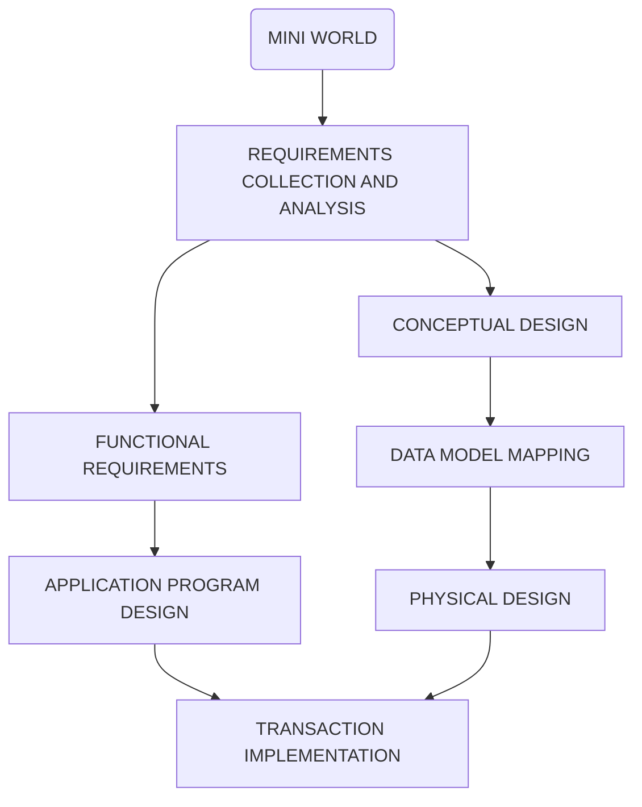

# Databases

## Introduction

Data -> Facts: Product of observation

Ways to register data:

* Unstructured Data: ex. txt files
* Structured Data (SQL) : ex. tabular representation
* Semi-structured (MongoDB): ex. XML, JSON

Why keep data?

* To take some action based on the data
* Data that is used to answer questions do analysis ->information

### Source of Data

Mini World:

* Data cannot be known about the entire world or about everything or every topic.
* We need to restrict the domain from which we are going to gather data.

* The data that we store about our mini-world can be:
  * Used directly
  * Through a system (Information System)

Information System (Application) Design

* **Left Track is system design** while **right track is data design**




### Data Storage

* **Sequential (access) files**: 
  * Data can only be read/stored sequentially.
* **Random access files:** 
  * In order to be able to effectively use random access files, we need to have efficient algorithms for insertion, deletion, and searching.
  * B+ trees, Hash Tables

### Concurrency

* Two or more users want to access the same file location at the same time

### DBMS (Database Management System)

* **Definition**: efficient, reliable, convenient, and safe multi-user storage of and access to massive amounts of persistent data

#### Desirable services provide by many IM  (Information Management System) and DBMS

* **Persistence**: Maintain information even after program stops
* **Convenient Access**: 
  * Ability to ask question declaratively rather than programmatically
  * Hide and change implementation
  * Queries optimized to speed up answering
* **Deal with massive amounts of facts**
* **Performance**: High speed even in the presence of many operations and data
* **Consistency during concurrent access**.

#### Other Features (Specialized IM)

* **Resilience**: Ability to survive hardware, software, and power failures
* **Reliability**: Almost always up
* **Scalability**: Data can be scaled to demand or size needs

### Types of Database Models

* **Hierarchical Model**
  * Assumes that all the data that is **stored is organized hierarchically**
  * The Hierarchical model looks like a **tree**, and elements are found by following the links.
  * Every node has just one parent
  * ex. File Systems and Geographical Information Systems
* **Network Model**
  * Assumes that a **given node might have more than one parent**
  * Search by following pointers
* **Relational Model**
  * Uses relations or tables
  * Search by content not by following links or pointers.
  * ER Diagram -> Relations
* **Object Oriented Model**
  * Lots of problems when communicating OO applications with databases in relational model
  * In order to try to circumvent the problems of OO – Database connectivity and work on a common set of data.

## Conceptual Design

### Entity - Relationship Diagrams

* **Entity Sets**: Set of similar elements
  * No duplicate elements
  * **Candidate Key:** minimal set of attributes that uniquely identifies an element 
    * **Minimal**: If an attribute is removed from a set then there is not enough information to uniquely identify the element.
    * ex. name alone can't identify an employee but name and phone number might
  * **Primary Key:**
    * The chosen candidate key will be enforced by the DBMS
    * The primary key attributes will be **underlined in their circles**
    * Every entity set must have a primary key
  * Rectangle with element
* **Attributes**: Aspects of an elements
  * **Circles** = **Single Attribute** (ex. Name)
  * **Double Border Circles** = **Multivalued Attributes** (ex. Phone Numbers)
  * **Circles with child circles** = **Composite Attributes** (ex. Address)
  * **Dotted Circle** = **Derived Attribute**: computed from the other attributes in the entity set (ex. age calculated form date of birth attribute)
* **Domain**: Need to specify if attributes aren't clear
* **Relationship**: Connection between Entity Sets
  * Represented by a **diamond**
  * Attributes can be added to the relationship
* **Cardinality**:
  * Many to Many
  * One to Many: Every element from A is related to at most one element from B (-> at most one)
    * ex. Professor can teach many courses, but a course is taught by 1 professor
  * One to One: Each element from A is related to at most one element from B and each element from B is related to at most one element from A
    * ex. A Professor can only have one office, and a office can only have one professor

ex. Employees work for Departments

* Departments have an id, address, name, phone
* Employees have a ssn, name, phone, dob
* Each employee cannot work for more than one department
* Each department can have many employees


* **Participation Constraints:**
  * **Total**: Every Element from one side must participate in the relation ship 
    * Represented by a **thick line = at least one**
    * A total one to many relationship = at least one element and at most one element = **exactly one = thick line with arrow**
  * **Partial**: **Normal Line**
* **Assumptions**: Include in diagram to help determine decisions.
* **Cardinality Notation**:
  * min / at least . . max / at most
    * Partial Participation Constraint (**Normal Line**)  = 0 . . N
    * Total Participation Constraint (**Thick Line**) = 1 . . N
    * Partial Participation Constraint with Arrow (**Normal Line with Arrow**) = 0 . . 1
    * Total Participation Constraint with Arrow (**Thick Line with Arrow**) = 1 . . 1
  * Put on a Normal Line to relationship
  * Always use arrow notation unless it is necessary  to use cardinality notation

* **Roles**: Used when an Element uses a relationship to itself
  * Place roles on respective lines

### ISA Hierarchy

* Inheritance
* Used to factor out common attributes
* Used to divide in sets (subsets)
* **Triangle with "ISA" in it**
* ISA property (test): Child element "is a" subset of the Parent element
* **Constraints**:
  * Written next to ISA triangle as **{Covering Constraint Type, Overlap Constraint Type}**
  * **Covering**: Will sets cover all possible elements?
    * Complete: Yes
    * Partial: No
  * **Overlap:** Do sets overlap?
    * Disjoint: No
    * Overlapping: Yes

ex. Cardinality Notation for the following description:

A veterinary hospital only treats dogs and cats (use ISA). Clients have an address, phone number and client ID. Each pet has a name, a pet ID and belongs to exactly one client. Each client can have at most 5 cats and 2 dogs. 

-Client ER Diagram.jpg)


### Weak Entity Sets

* Entity set that **does not have its own keys (primary keys)**
* Will take the keys from another Entity Set
* Will be a **double border rectangle**
* Identifying relationship = **double border diamond**
* Weak entity set has a **Total Participation Constraint with an Arrow** (<==)
* Weak entity sets can help contribute to a primary key with a **partial key = dashed underline**

ex. E-R Diagram for the following:

* Book

  * authors
  * title
  * date

* BookEdition

  * publisher
  * format
  * date
  * Note: There is no primary key here

* BookCopy (needs to inherit attributes from book)

  * callNumber
  * location
  * copyNumber

* **Note: Subclasses does not automatically make some thing comply with IsA inheritance.** 

* Need to use the IsA test

  

* Concept shown is called **Manifestation**

  * BookEdition is a manifestation of a book
  * BookCopy is a manifestation of a BookEdition


ex. We want to keep track of expenses of Employees on their dependent's health insurance policies

* Weak Entity to Entity


### Design Considerations

* Entity set vs Attribute
  * Multivalued attributes may cause problems with redundancy
  * Better to just use them as another entity set
  * E-R diagram not unique for every situation
* Attribute vs Relationship
  * Using an attribute or having an entity have a relationship with itself

### N-ary Relationships

* Some relationships are ill conceived and can be better represented in a binary relationship
* N-ary relationp -> Binary Relationship:
  * Change central relationship into a weak entity set
  * Have the weak entity set connected exactly one to each entity set (Identifying Relationship)
  * Process called **Reification**

ex. Convert a Part, Project, and Maker relationship into a binary relationship

1. Add a couple of attributes to each entity set
2. Use Reification to transform it into a diagram with only binary relationships


### Aggregation

* Trying to connect a relationship to another relationship
* Draw a dotted line around the central relationship to have it treated as one entity.
* Then use reification to achieve the proper diagram

## Relational Model

* Everything is a relation
* Relations = Tables
  * First Row: **Header (Schema)**
  * Column Names = **Fields**
  * Each Row = **Tuples**
  * Content below header = **Instance; is dynamic**

ex. Student Table/Relation

|  id  | name  | age  |
| :--: | :---: | :--: |
| 5275 | Smith |  18  |
| 2653 | Guldu |  22  |
| 5463 | Jones |  18  |

Schema: Student(id: integer, name: varchar(50), age: integer)

* Domains:
  * int/integer
  * double/float
  * varchar(n) = string of length at most n
  * char(n) = string of length exactly equal to n
  * date
  * time
  * datetime
  * boolean

ex. Write the relation database schema for a Company that has employees who have a SSN, name, phone, date  of birth and work for departments (remember that you need a table for worksFor). Departments have a name, a phone, and a location


### Properties of Relations

* **Degree/r-aty of relation** = number of fields
* **Number of tuples** = cardinality
* **Instances of Relations are sets**
  * No duplicates are allowed
  * Note: Some DBMS will allows some duplicates

* Relational Database
  * Collection of relations with distinct names

### Integrity Constraints (IC)

* DBMS enforces them
* Domain Constraint: Prevent entry of incorrect data
* Might make changes to enforce IC

#### Primary Key (PK)

* Are unique

* **Candidate Key:**  A minimal set of fields that uniquely identifies a tuple
  * A primary key is a chosen candidate key that is enforced by the DBMS
* Primaries keys are stored in B+Trees
* Notations:
  * **PK has several attributes**: Students(sid: int, dob: date, name: varchar(50), primary key (sid))
  * **PK with only one field**: Students(sid: int primary key, dob: date, name: varchar(50))
  * **Informal/Only for examples:** Students(<u>sid</u>, dob, name) - Underlined is the PK

#### Foreign Key (FK)

* Set of fields that makes a reference to a PK of another table

* Example:

  Students(<u>sid</u>, name, age, gpa)

  EnrolledIn(<u>sid</u>, cid, grade, foreign key (sid) references Students)

**Properties:**

1. **Same or compatible domains**

   A(f1, f2, f3, f4, primary key(f2, f3))

   B(g1, g2, g3, g4, g5, primary key(g1, g3), foreign key(g3, g4) references A)

   g3 and g4 actually reference f2 and f3 respectively. **Domain is same or compatible**

2. **FK making a reference to the same table**

   person(ssn, name, parent, primary key(ssn), foreign key(parent) references person)

   parent in this case is a ssn of another person

#### Referential Integrity Constraints

* **Insertion operation:** Inserting a tuple into table
  * DBMS will Reject/**Restrict** as tuple does not exist in referenced table
* **Deletion operation:** Deleting from a table (source table)
  * DBMS will Reject/**Restrict** as tuple in referencing table will reference nothing
  * **Cascade**: DBMS will also delete the tuple that includes the reference from referencing table
  * **set NULL**: Replace the reference with NULL or null value
  * **set default**
* **Update operation**: Updating source table
  * Restrict/Reject
  * Cascade the change
  * set NULL
  * set default
* Operations will be specified in the schema (default action is restrict)
  * on delete _
  * on update _
  * on insert _

ex.


## ER Diagrams into Relational Models

### Many-to-Many

**ER Diagram**


**Relational Model**

* relationship must have primary keys **from all involved entities**

```
Students(sid: int, name: varchar(50), age: int, gpa: float, primaryKey(sid))
Courses(cid: varchar(7), title: varchar(30), dept: varchar(4), primaryKey(cid))
enrolledIn(sid: int, cid: varchar(7), grade: varchar(2), primaryKey(sid, cid), 
	foreignKey(sid) references Students, foreignKey(cid) references Courses)
```


### Reflexive

**ER Diagram**


* **NOTE: Always remember to consider assumptions and domains**

**Relational Model**

```
Employee(eId: int, name: varchar(50), primaryKey(eId))
manages(manager-eId: int, subordinate-eId: int, from: date, till: date, 
	primaryKey(manager-eId, subordinate-eId), 
	foreignKey(manager-eId) references Employee,
	foreignKey(subordinate-eId) references Employee)
```

### One-to-Many

**ER Diagram**


**Relational Model**

* relationship must have primary keys **from entities with arrows**

```
Car(vin: varchar(20), color: varchar(10), primaryKey(vin))
Person(pid: int, age: int, primaryKey(pid))
ownedBy(vin: varchar(20), pid: int, since: date, 
	primaryKey(vin), 
	foreignKey(vin) references Car, 
	foreignKey(pid) references Person)
```

### One-to-One

**ER Diagram**


**Relational Model**

* relationship will get primary key from **any single entity involved (this can be further specified via thickness of arrows)**

```
Person(pid: int, name: varchar(50), age: int, primaryKey(pid))
Office(building: varchar(20), number: int, sqft: int, 
	primarKey(building, number))
Assigned(pid: int, building: varchar(20), number: int, since: date, 
	primaryKey(pid), 
	foreignKey(pid) references Person, 
	foreignKey(building, number) references Office)
```

### Weak Entity Sets

**ER Diagram**


**Relational Model**

* treat relationship and weak entity set as one relationship
* primary key is from **identifying set and the partial key**

```
Employee(eId: int, firstName: varchar(20), lastName: varchar(20), 
	primary key(eId))
relativeOf(eId: int, firstName: varchar(20), age: int, 
	primary key(eId, firstName), 
	foreign key(eId) references Employee)
```

### Weak Entity Sets Related to Normal Entity Sets

**ER Diagram**


**Relational Model**

* treat relationship and weak entity set as one relationship
* primary key is from **identifying sets and the partial key**

```
Employee(eId: int, firstName: varchar(20), lastName: varchar(20), 
	primary key(eId))
School(sName: varchar(20), primary key(sName))
relativeOf(eId: int, firstName: varchar(20), age: int, 
	primary key(eId, firstName), 
	foreign key(eId) references Employee)
attends(eId: int, firstName: varchar(20), sName: varchar(20), since: data,
	primary key(eId, firstName, sName),
	foreign key(ed, firstName) references of relativeOf,
	foreign key(sName) references School)
```

### ISA Relationships

**ER Diagram**


**Relational Model**

```
Person(ssn: char(11), name: varchar(50), primary key(ssn))
Student(ssn: char(11), gpa: float, 
	primary key(ssn), 
	foreign key(ssn) references Person)
Student(ssn: char(11), salary: float, 
	primary key(ssn), 
	foreign key(ssn) references Person)
```

### Aggregation

**ER Diagram**


**Relational Model**

```
Employee(ssn: char(11), name: varchar(50), primary key(ssn))
Project(pid: int, startedOn: data, primary key(pid))
Department(did: varchar(4), dname: varchar(20), primary key(did))
Undertakes(pid: int, did: varchar(4), since: date, 
	primary key(pid, did),
	foreign key(pid) references Project,
	foreign key(did) references Department)
Monitors(ssn: char(11), pid: int, did: varchar(4), until: date,
	primary key(ssn, pid, did),
	foreign key(ssn) references Employee,
	foreign key(pid, did) references Undertakes)
```

### Merge Rule

**IF**: 

​	T(K, X, primary key(K))

​	S(K2, Y, primary key(K2), foreign key (K2) references T)

​	and **Y is not NULL** (because otherwise we don't know what tables an element belongs to)

**THEN**:

​	**Merge**: TS(K, X, Y, primary key(K))

**Merge Priority**: Thick Arrow Side > Arrow Side > Normal Line

* If there is both thick arrows or both normal arrows then merge either side

* If there is a **thick arrow** need to add **NOT NULL to the foreign key**

#### One-to-One


```
Office(building, number, sqFT,
	primary key(building, number))
Employee(eid, name, dob, building, number,
	primary key(eid),
	foreign key(building, number) references Office NOT NULL)
```

#### One-to-Many


```
A(Ka, c, primary key(Ka))
B(Kb, d, primary key(kb)) - Part of the final schema
R(Ka, Kb, p, q, 
	primary key(Ka), 
	foreign key(Ka) references A,
	foreign key(Kb) references B)
Merged: AR(Ka, c, Kb, p, q, 
	primary key(Ka),
	foreign key(Kb) references B) - Part of the final schema
```

#### ISA


```
A(Ka, p, primary key(Ka))
B(Ka, q, primary key(Ka), foreign key(Ka) references A)
C(Ka, s, primary key(Ka), foreign key(Ka) references A)

Merge AB: AB(Ka, p, q, primary key(Ka))
Merge ABC: ABC(Ka, p, q, s, primary key(Ka))
```

Problems:

* Can have many NULL Values
* Not sure how to distinguish which fields are for the child sets 

#### ISA - Collapse Down


```
Dog(pid, name, primary key(pid))
Cat(pid, name, primary key(pid))
```

* **Not a merge rule**
* When ISA relationship is {disjoint, complete}

## Relational Design Principles

* Reduce the number of tables
* Avoid unnecessary redundancy
* Reduce NULL values (memory use)

## SQL and MySQL

### General Information

* SQL (structured query language) language **combines four languages** into one:
  * **Create Data Schema** for DBMS
    * Language to provide the schema (L<sub>SCHEMA</sub>)
  * **Tell facts** about the data 
    * Language to tell facts (L<sub>TELL</sub>)
  * **Ask** (query) the DBMS
    * Language to ask questions or query language (L<sub>QUERY</sub>)
  * **Answer**
    * Language in which the answer is provided (L<sub>ANSWER</sub>)

* **Multiple Implementations** 
  * MySQL
  * SQL server
  * Oracle
  * PostgreSQL
  * Compatibility issues between the different implementations of SQL

### How to communicate with SQL

* Command line which requires a semicolon ;
* Application ----------- connection(using JDBC for this class) ----instructions(strings)--->DBMS
  * No semicolon required

### Basic Database Commands

* Create Database: 

  * ```sql
    create database DATABASENAME;
    ```

* Use Database: 

  * ```sql
    use DATABASENAME;
    ```

* Delete Database if exist: 

  * ```sql
    drop database if exists DATABASENAME;
    ```

* Delete (drop) Database: 

  * ```sql
    drop database DATABASENAME;
    ```

* Show all databases

  * ```sql
    show databases;
    ```

### Data Types

| MySQL String Types          | Description                                                  |
| --------------------------- | ------------------------------------------------------------ |
| CHAR(size)                  | A FIXED length string (can contain letters, numbers, and special characters). The *size* parameter specifies the column length in characters - can be from 0 to 255. Default is 1 |
| VARCHAR(size)               | A VARIABLE length string (can contain letters, numbers, and special characters). The *size* parameter specifies the maximum column length in characters - can be from 0 to 65535 |
| BINARY(size)                | Equal to CHAR(), but stores binary byte strings. The *size* parameter specifies the column length in bytes. Default is 1 |
| VARBINARY(size)             | Equal to VARCHAR(), but stores binary byte strings. The *size* parameter specifies the maximum column length in bytes. |
| TINYBLOB                    | For BLOBs (Binary Large OBjects). Max length: 255 bytes      |
| TINYTEXT                    | Holds a string with a maximum length of 255 characters       |
| TEXT(size)                  | Holds a string with a maximum length of 65,535 bytes         |
| BLOB(size)                  | For BLOBs (Binary Large OBjects). Holds up to 65,535 bytes of data |
| MEDIUMTEXT                  | Holds a string with a maximum length of 16,777,215 characters |
| MEDIUMBLOB                  | For BLOBs (Binary Large OBjects). Holds up to 16,777,215 bytes of data |
| LONGTEXT                    | Holds a string with a maximum length of 4,294,967,295 characters |
| LONGBLOB                    | For BLOBs (Binary Large OBjects). Holds up to 4,294,967,295 bytes of data |
| ENUM(val1, val2, val3, ...) | A string object that can have only one value, chosen from a list of possible values. You can list up to 65535 values in an ENUM list. If a value is inserted that is not in the list, a blank value will be inserted. The values are sorted in the order you enter them |
| SET(val1, val2, val3, ...)  | A string object that can have 0 or more values, chosen from a list of possible values. You can list up to 64 values in a SET list |

| MySQL Numeric Data Types | Description                                                  |
| ------------------------ | ------------------------------------------------------------ |
| BIT(*size*)              | A bit-value type. The number of bits per value is specified in *size*. The *size* parameter can hold a value from 1 to 64. The default value for *size* is 1. |
| TINYINT(*size*)          | A very small integer. Signed range is from -128 to 127. Unsigned range is from 0 to 255. The *size* parameter specifies the maximum display width (which is 255) |
| BOOL                     | Zero is considered as false, nonzero values are considered as true. |
| BOOLEAN                  | Equal to BOOL                                                |
| SMALLINT(*size*)         | A small integer. Signed range is from -32768 to 32767. Unsigned range is from 0 to 65535. The *size* parameter specifies the maximum display width (which is 255) |
| MEDIUMINT(*size*)        | A medium integer. Signed range is from -8388608 to 8388607. Unsigned range is from 0 to 16777215. The *size* parameter specifies the maximum display width (which is 255) |
| INT(*size*)              | A medium integer. Signed range is from -2147483648 to 2147483647. Unsigned range is from 0 to 4294967295. The *size* parameter specifies the maximum display width (which is 255) |
| INTEGER(*size*)          | Equal to INT(size)                                           |
| BIGINT(*size*)           | A large integer. Signed range is from -9223372036854775808 to 9223372036854775807. Unsigned range is from 0 to 18446744073709551615. The *size* parameter specifies the maximum display width (which is 255) |
| FLOAT(*size*, *d*)       | A floating point number. The total number of digits is specified in *size*. The number of digits after the decimal point is specified in the *d* parameter. This syntax is deprecated in MySQL 8.0.17, and it will be removed in future MySQL versions |
| FLOAT(*p*)               | A floating point number. MySQL uses the *p* value to determine whether to use FLOAT or DOUBLE for the resulting data type. If *p* is from 0 to 24, the data type becomes FLOAT(). If *p* is from 25 to 53, the data type becomes DOUBLE() |
| DOUBLE(*size*, *d*)      | A normal-size floating point number. The total number of digits is specified in *size*. The number of digits after the decimal point is specified in the *d* parameter |
| DECIMAL(*size*, *d*)     | An exact fixed-point number. The total number of digits is specified in *size*. The number of digits after the decimal point is specified in the *d* parameter. The maximum number for *size* is 65. The maximum number for *d* is 30. The default value for *size* is 10. The default value for *d* is 0. |
| DEC(*size*, *d*)         | Equal to DECIMAL(size,d)                                     |

| Date and Time data types | Description                                                  |
| ------------------------ | ------------------------------------------------------------ |
| DATE                     | A date. Format: YYYY-MM-DD. The supported range is from '1000-01-01' to '9999-12-31' |
| DATETIME(*fsp*)          | A date and time combination. Format: YYYY-MM-DD hh:mm:ss. The supported range is from '1000-01-01 00:00:00' to '9999-12-31 23:59:59'. Adding DEFAULT and ON UPDATE in the column definition to get automatic initialization and updating to the current date and time |
| TIMESTAMP(*fsp*)         | A timestamp. TIMESTAMP values are stored as the number of seconds since the Unix epoch ('1970-01-01 00:00:00' UTC). Format: YYYY-MM-DD hh:mm:ss. The supported range is from '1970-01-01 00:00:01' UTC to '2038-01-09 03:14:07' UTC. Automatic initialization and updating to the current date and time can be specified using DEFAULT CURRENT_TIMESTAMP and ON UPDATE CURRENT_TIMESTAMP in the column definition |
| TIME(*fsp*)              | A time. Format: hh:mm:ss. The supported range is from '-838:59:59' to '838:59:59' |
| YEAR                     | A year in four-digit format. Values allowed in four-digit format: 1901 to 2155, and 0000.<br/>MySQL 8.0 does not support year in two-digit format. |

### Table (Relation) Commands

Tables referenced in examples:

| Students | Enrolledin | Courses |
| -------- | ---------- | ------- |
| sid      | sid        | cid     |
| name     | cid        | name    |
| age      | grade      | dept    |
| gpa      |            |         |

* **create table**:

  * General Case:

    * ```sql
      create table TABLENAME(
      	field1 type,
          field2 type,
          ...,
          primary key(fields),
          foreign key (fields) references TABLENAME2(PRIMARY KEYS of TABLENAME2)
      );
      ```

  * **One attribute** primary key:

    * ```sql
      create table TABLENAME(
      	field1 type primary key,
          ...,
          field2 type,
          foreign key (fields) references TABLENAME2(PRIMARY KEYS of TABLENAME2)
      );
      ```

* **alter table**:

  * **Drop** field:

    * ```sql
      alter table TABLENAME drop FIELD;
      ```

  * **Add** field:

    * ```sql
      alter table TABLENAME add FIELD type;
      ```

  * **Change** the primary keys or foreign keys of an already created table

    * ```sql
      alter table TABLENAME
      add constraint primary key(field(s));
      ```

    * ```sql
      alter table TABLENAME
      add constraint foreign key(field(s)) 
      	references TABLENAME2(PRIMARY KEYS of TABLENAME2);
      ```

* How to **list** all the tables

  * ```sql
    show tables;
    ```

* **See table's schema**

  * ```sql
    describe TABLENAME;
    ```

* **Delete (drop) table if exists**

  * ```sql
    drop table if exists TABLENAME;
    ```

* **Delete (drop) table**

  * ```sql
    drop table TABLENAME;
    ```

* **Insert** data into table

  * When you only have **some values** for the **tuple**:

    * ```sql
      insert into TABLENAME(fields you want to insert into) values (values);
      ```

  * When you have **all** the **values** for the **tuple:**

    * ```sql
      insert into TABLENAME values 
      	(_, _, _),
      	(_, _, _),
      	(_, _, _);
      ```

    * Order of the tuple is the order of the fields in the relation

* **Delete certain data** from **table:**

  * ```sql
    delete from TABLENAME where CONDITION;
    ```

* **Update values** in the **tables:** 

  * ```sql
    update TABLENAME, TABLENAME2, ...
    	set field1 = _, field2 = _,...
    	where CONDITION;
    ```

* **Alias**

  * Used to rename a certain table/fields used in a query

  * Syntax:

    * ```sql
      tableName/fieldName as ALIASNAME
      tableName/fieldName ALIASNAME
      ```

### Queries

* ```sql
  select field1, field2, ...
  from TABLENAME1, TABLENAME2, ...
  where CONDITION
  ```

* Returns at table where fields names are column names

#### Operators

* **Star or * operator**

  * represents everything

  * ```sql
    select * from TABLENAME1 where CONDITION
    ```

* **Like operator**

  * Used for string comparison (can use regex to match the string)

  * ```sql
    --Students where name starts w/H (0 or more characters after):
    select name from students where name like 'H%';
    --Students where name starts w/H (0 or more characters after):
    select name from students where name like 'H%O';
    --Students where name starts w/H then 4 characters:
    select name from students where name like 'H___';
    ```

* **General Operators**

  * For strings these operators will work in lexicographical order (ex. a > b returns true)
  * **=, >, <, >=, <=, <>(not equal)**
  * **in**
    * Returns true if the value is inside the subquery
  * **not in**
    * Returns true if the value is not inside the subquery
  * **exists**
    * returns true if the subquery is not empty
  * **and**
  * **or**
  * **not**

* **Joining Tables**

  * Gives the cartesian product (cross product) of the tables if no CONDITION is specified
  * If condition is specified, the query will give you a table that contains tuples where that condition is true

* **Set Operators**

  * Returns a set (no duplicates)

  * Attributes (fields) from the first query must match the attributes (fields) of the second query

  * Union:

    * ```sql
      --Names of Students who have enrolled in cs or math courses
      select s.name
      	from students S, 
      	enrolledin e, 
      	courses c
      where s.sid = e.sid 
      	and e.cid = c.cid
      	and c.dept = 'cs'
      	
      union
      
      select s.name
      	from students S, 
      	enrolledin e, 
      	courses c
      where s.sid = e.sid 
      	and e.cid = c.cid
      	and c.dept = 'math';
      ```

  * Intersect:

    * Not supported in MySQL

    * Solution: Subqueries

      * ```sql
        --Names of Students who have enrolled in cs and math courses:
        select s.name
        	from students s, 
        	enrolledin e, 
        	courses c
        where s.sid = e.sid 
        	and e.cid = c.cid
        	and c.dept = 'cs'
        	and s.sid in(
            	select s.id
        			from students s, 
        			enrolledin e, 
        			courses c
        		where s.sid = e.sid 
        			and e.cid = c.cid
        			and c.dept = 'math'
        		)
        ;
        ```

  * Except:

    * Not supported in MySQL

    * Solution: Subqueries

      * ```sql
        --Students enrolled in 198:336 but not taking 198:323 (using except)
        select s.name
        	from Student s,
        	enrolledin e
        where s.sid = e.sid
        	and e.cid = '198:336'
        
        except
        
        select s.name
        	from Student s,
        	enrolledin e
        where s.sid = e.sid
        	and e.cid = '198:323'
        
        --Students enrolled in 198:336 but not taking 198:323 (no except)
        select s.name
        	from students s, 
        	enrolledin e 
        where s.sid = e.sid
        	and e.cid = '198:336'
        	and s.sid not in(
            	select s.id
        			from students s, 
        			enrolledin e
        		where s.sid = e.sid 
        			and e.cid = '198:323'
        		)
        ;
        ```

* **Subqueries:**

  * X =
  * X in
  * X not in
  * X > any (subquery) 
    * **Returns true** if **x** is **greater** than **at least one element** in the **subquery** 
  * X > all (subquery)
    * **Returns true** if **x** is **greater** than **all elements** in the **subquery**
  * exists (subquery)
    * **Returns true** if the **subquery** is **not empty** 
  * not exists (subquery)
    * **Returns true** if the **subquery** is **empty**

  ```sql
  --Name of students not enrolled in 198:111 (Simple Way)
  select s.name
  from students s
  where s.side not in (
      select e.sid
      from enrolledin e
      where e.cid = "198:11"
  )
  order by s.name desc; -- asc/desc
  
  --Name of students not enrolled in 198:111 (CORRELATED SUBQUERY)
  select s.name
  from students s
  where not exists (
      select *
      from enrolledin e
      where e.sid = s.side 
      	and e.cid = "198:11"
  )
  order by s.name asc; -- asc/desc
  
  --Find name of students whose gpa is greater than someone called Horatio
  select s.name
  from students s
  where s.gpa > any(
  	select s.gpa
      from students s
      where name = "Horatio"
  );
  ```

* **Distinct**

  * Gets **rid of duplicates**

  * Affects the entire tuple (gives you query that all the fields are unique)

  * ```sql
    --Names of students enrolled in CS courses. No duplicates
    select distinct s.name
    from students s,
    	enrolledin e,
    	courses c
    where s.sid = e.sid
    	and e.cid = c.cid
    	and c.dept = "cs";
    ```

* **Aggregate Operators**:

  * **Count**

    * Counts the number if tuples where the field is not null
    * Syntax:
      * **count**(*)
      * **count**(field) 

  * **Sum**

    * Sums all the particular field
    * Syntax:
      * **sum**(field)

  * **Max**

    * max of that particular field

    * Syntax:

      * **max**(field)

    * ```sql
      --Find maximum age of students
      select max(age) from students;
      ```

  * **Min**

    * min of that particular field

    * Syntax:

      * **min**(field)

    * ```sql
      --Find minimum gpa of students
      select min(gpa) from students;
      ```

  * **Avg**

    * the avg of that particular field
    * Syntax:
      * **avg**(field)

  * **Group by**

    * Often used with aggregate operators

    * Syntax:

      * **group by**(field(s))

    * ```
      t1    Find the sum of y's for each a
      x|y   SOLUTION:
      ---   
      a|1   select x, sum(y)
      a|3   from t1
      a|2   group by x;
      ---
      b|4
      b|1
      ---
      c|5
      c|2
      c|3
      ```

    * ```sql
      --Number of courses offered by each department
      select c.dept, 
      	count(*)
      from courses c
      group by c.dept;
      ```

    * ```sql
      --Find average age of students enrolled in each course
      select e.cid, 
      	avg(s.age)
      from students s, 
      	enrolledin e
      where s.sid = e.sid
      group by c.cid;
      ```

    * ```sql
      --Find name of students with max gpa
      select s.name
      from students s
      where s.gpa = (
      	select max(gpa)
          from students
      );
      ```

