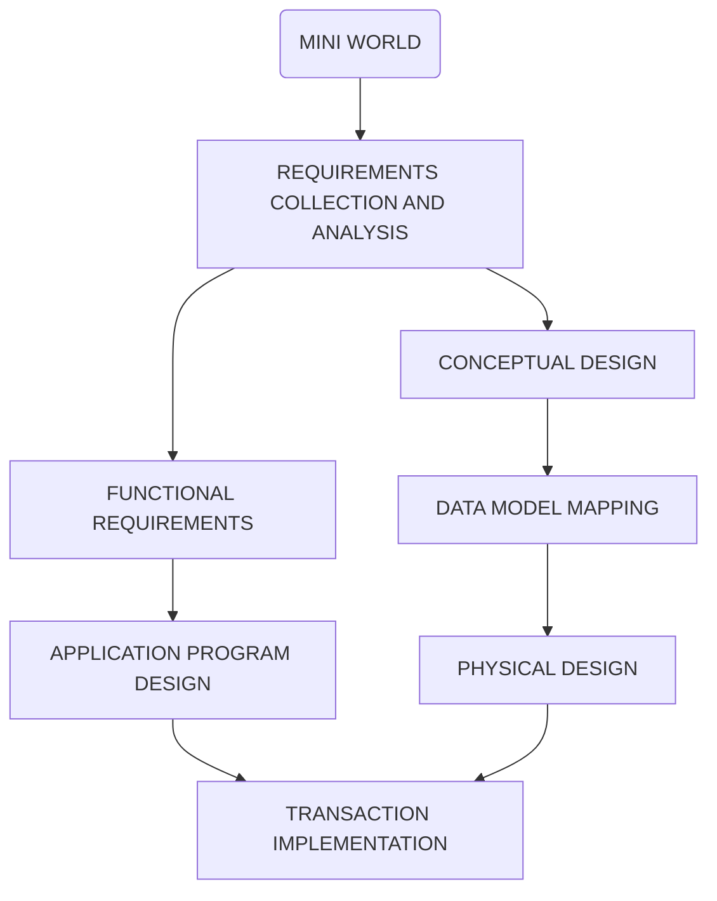

# Databases

## Introduction

Data -> Facts: Product of observation

Ways to register data:

* Unstructured Data: ex. txt files
* Structured Data (SQL) : ex. tabular representation
* Semi-structured (MongoDB): ex. XML, JSON

Why keep data?

* To take some action based on the data
* Data that is used to answer questions do analysis ->information

### Source of Data

Mini World:

* Data cannot be known about the entire world or about everything or every topic.
* We need to restrict the domain from which we are going to gather data.

* The data that we store about our mini-world can be:
  * Used directly
  * Through a system (Information System)

Information System (Application) Design

* **Left Track is system design** while **right track is data design**

### Data Storage

* **Sequential (access) files**: 
  * Data can only be read/stored sequentially.
* **Random access files:** 
  * In order to be able to effectively use random access files, we need to have efficient algorithms for insertion, deletion, and searching.
  * B+ trees, Hash Tables

### Concurrency

* Two or more users want to access the same file location at the same time

### DBMS (Database Management System)

* **Definition**: efficient, reliable, convenient, and safe multi-user storage of and access to massive amounts of persistent data

#### Desirable services provide by many IM  (Information Management System) and DBMS

* **Persistence**: Maintain information even after program stops
* **Convenient Access**: 
  * Ability to ask question declaratively rather than programmatically
  * Hide and change implementation
  * Queries optimized to speed up answering
* **Deal with massive amounts of facts**
* **Performance**: High speed even in the presence of many operations and data
* **Consistency during concurrent access**.

#### Other Features (Specialized IM)

* **Resilience**: Ability to survive hardware, software, and power failures
* **Reliability**: Almost always up
* **Scalability**: Data can be scaled to demand or size needs

### Types of Database Models

* **Hierarchical Model**
  * Assumes that all the data that is **stored is organized hierarchically**
  * The Hierarchical model looks like a **tree**, and elements are found by following the links.
  * Every node has just one parent
  * ex. File Systems and Geographical Information Systems
* **Network Model**
  * Assumes that a **given node might have more than one parent**
  * Search by following pointers
* **Relational Model**
  * Uses relations or tables
  * Search by content not by following links or pointers.
  * ER Diagram -> Relations
* **Object Oriented Model**
  * Lots of problems when communicating OO applications with databases in relational model
  * In order to try to circumvent the problems of OO – Database connectivity and work on a common set of data.

## Conceptual Design

### Entity - Relationship Diagrams

* **Entity Sets**: Set of similar elements
  * No duplicate elements
  * **Candidate Key:** minimal set of attributes that uniquely identifies an element 
    * **Minimal**: If an attribute is removed from a set then there is not enough information to uniquely identify the element.
    * ex. name alone can't identify an employee but name and phone number might
  * **Primary Key:**
    * The chosen candidate key will be enforced by the DBMS
    * The primary key attributes will be **underlined in their circles**
    * Every entity set must have a primary key
  * Rectangle with element
* **Attributes**: Aspects of an elements
  * **Circles** = **Single Attribute** (ex. Name)
  * **Double Border Circles** = **Multivalued Attributes** (ex. Phone Numbers)
  * **Circles with child circles** = **Composite Attributes** (ex. Address)
  * **Dotted Circle** = **Derived Attribute**: computed from the other attributes in the entity set (ex. age calculated form date of birth attribute)
* **Domain**: Need to specify if attributes aren't clear
* **Relationship**: Connection between Entity Sets
  * Represented by a **diamond**
  * Attributes can be added to the relationship
* **Cardinality**:
  * Many to Many
  * One to Many: Every element from A is related to at most one element from B (-> at most one)
    * ex. Professor can teach many courses, but a course is taught by 1 professor
  * One to One: Each element from A is related to at most one element from B and each element from B is related to at most one element from A
    * ex. A Professor can only have one office, and a office can only have one professor

ex. Employees work for Departments

* Departments have an id, address, name, phone
* Employees have a ssn, name, phone, dob
* Each employee cannot work for more than one department
* Each department can have many employees

* **Participation Constraints:**
  * **Total**: Every Element from one side must participate in the relation ship 
    * Represented by a **thick line** = at least one
    * A total one to many relationship = at least one element and at most one element = exactly one = thick line with arrow
  * **Partial**: **Normal Line**
* **Assumptions**: Include in diagram to help determine decisions.
* **Cardinality Notation**:
  * min . . max / at least . . at most
    * Partial Participation Constraint (Normal Line)  = 0 . . N
    * Total Participation Constraint (Thick Line) = 1 . . N
    * Partial Participation Constraint with Arrow (Normal Line with Arrow) = 0 . . 1
    * Total Participation Constraint with Arrow (Thick Line with Arrow) = 1 . . 1
  * Put on a Normal Line to relationship
  * Always use arrow notation unless it is necessary  to use cardinality notation

* **Roles**: Used when an Element uses a relationship to itself
  * Place roles on respective lines

### ISA Hierarchy

* Inheritance
* Used to factor out common attributes
* Used to divide in sets (subsets)
* **Triangle with "ISA" in it**
* ISA property (test): Child element "is a" subset of the Parent element
* **Constraints**:
  * Written next to ISA triangle as **{Covering Constraint Type, Overlap Constraint Type}**
  * **Covering**: Will sets cover all possible elements?
    * Complete: Yes
    * Partial: No
  * **Overlap:** Do sets overlap?
    * Disjoint: No
    * Overlapping: Yes

ex. Cardinality Notation for the following description:

A veterinary hospital only treats dogs and cats (use ISA). Clients have an address, phone number and client ID. Each pet has a name, a pet ID and belongs to exactly one client. Each client can have at most 5 cats and 2 dogs. 

-Client%20ER%20Diagram.jpg)

